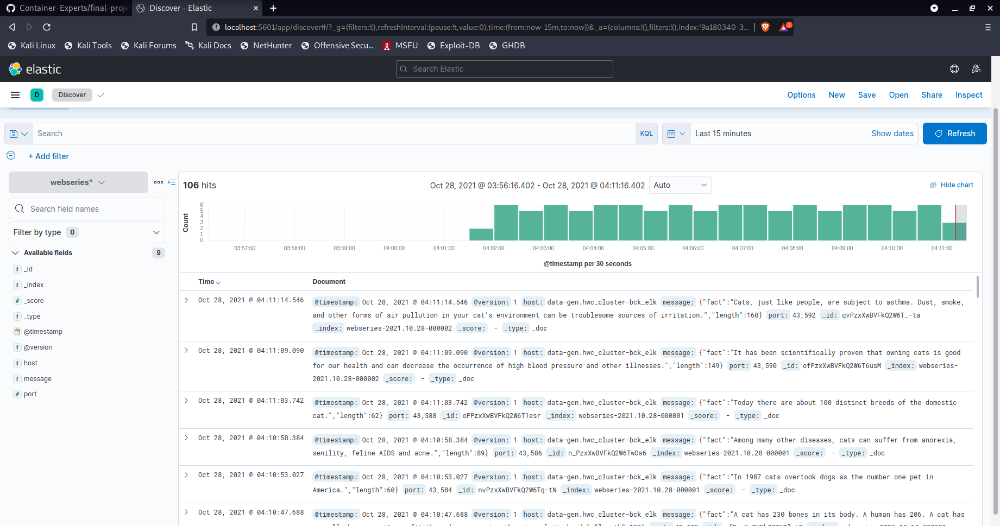
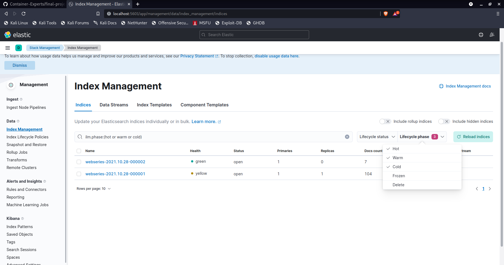
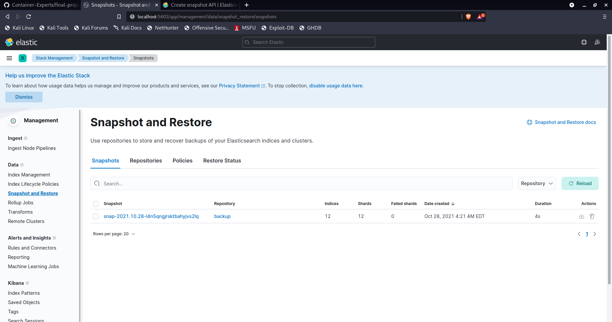

# Proyecto Final - Cluster ELK

## Estructurra Hot - Warm - Cold


## Eduard Arias

---

## **DESCRIPCIÓN DEL PROYECTO**

La arquitectura del proyecto se basa en el flijo de trabajo de [Logstash](https://www.elastic.co/logstash/). Está formado por un clúster con servicios basados en contenedores docker:

* Elasticsearch
* Logstash
* Kibana


La fuente generadora de datos es un contenedor Ubuntu 18.04 que tiene un servicio de llamado al [API Catfacts](https://catfact.ninja/fact). Toda la información es retornada en un JSON que después es enviada al flujo de logstash. El generador está programado para continuar la comunicación a pesar de que los servicios de ELK no estén disponibles, asegurando continuidad en su etapa. La cantidad de información generada y pasada es de aprox. &lt; 1KB/s.

Aqui un ejemplo de la información generada:

```
{
	"fact":"Abraham Lincoln loved cats. He had four of them while he lived in the White House.",
	"length":82
}
```


---


## **MANUAL DE USO**

### Requisitos

1. Docker


### Instalación


1. Descargar/clonar el repositorio de [Github](https://github.com/Container-Experts/final-project)

```
git clone https://github.com/Container-Experts/final-project
```

En el archivo [docker-HWC.yaml](./hwc_cluster-bck/docker-HWC.yml) está la configuración del cluster básico para el proyecto. Utilizamos la herramienta enbebida de docker llamada [docker-compose](https://docs.docker.com/compose/) para gestionar colecciones de contenedores como una aplicación atómica.


### Ejecución

1. Nos ubicamos en el directorio "hwc-cluster" (`cd hwc-cluster`) para tener el archivo de configuración docker.yml en el contexto de docker. 

2. Utilizamos el comando `docker-compose -f docker-HWC.yml up` para iniciar los servicios. El archivo de configuración tiene todo lo necesario para su ejecución.

### Configuración

En esta parte vamos a instalar las políticas de ILM y SLM que va a manejar el sistema. Solo es necesario hacerlo una vez.

#### ILM

1. Ubicamos el directorio raíz del proyecto. Ahí se encuentra el archivo llamado [ILM.json](./ILM.json) con la configuración de la arquitectura Hot-Warm-Cold
	* La configuración propuesta tiene tres fases principales para cada una requerida por la definición de la arquitectura, más una fase especial de eliminación.
	
```
	{
		"policy": {
		  "phases": {
		    "hot": {
		      "actions": {
		        "set_priority": {
		          "priority": 100
		        },
		        "rollover": {
		          "max_primary_shard_size": "10KB",
		          "max_age": "10m"
		        }
		      }
		    },
		    "warm": {
		      "min_age": "3m",
		      "actions": {
		        "set_priority": {
		          "priority": 50
		        }, 
		        "allocate": {
		              "require": {
		                      "box_type": "warm"
		              }
		        }
		      }
		    },
		    "cold": {
		      "min_age": "10m",
		      "actions": {
		        "set_priority": {
		          "priority": 0
		        }, 
		        "allocate": {
		              "require": {
		                      "box_type": "cold"
		              }
		        }
		      }
		    },
		    "delete": {
		      "min_age": "30m",
		      "actions": {
		        "delete": {}
		      }
		    }
		  }
		}
	} 	
	
```
* En la fase HOT, se crea la política de rollover para que no escriba en un mismo índice indefinidamente. Esto para aprovechar más los recursos del cluster y mejorar el rendimiento. Se le coloca una prioridad máxmia a la hora de ser candidatos para búsquedas.
	
* En la fase WARM, se le indica que solo los índices con edad mayor a tres minutos pueden ser llevados a esta etapa, con una prioridad de búsqueda media. Aquí, solo los índices que tengan la configuración de "WARM" en su construcción podrán ser candidatos, a diferencia de la etapa HOT, donde cualquiera puede alojar información.
	
* En la fase COLD, solo los índices con edad mayor a diez minutos pueden ser llevados a esta etapa, con una prioridad de búsqueda baja. Al igual que en la etapa WARM, se tiene una configuración especial que hace que solo los índices con "COLD" en su configucación puedan ser candidatos.

	
2. Con el clúster corriendo, ejecutamos el siguiente comando: 

```
curl -X PUT "localhost:9200/_index_template/timeseries_template?pretty" -H 'Content-Type: application/json' -d @ILM.json
```

Recibiremos la siguiente salida

```
{
	"acknowledged": "true"
}
```


#### Index Template

1. Una vez definida la política ILM, ahora es necesario definir una plantilla de índice. Esta es la configuración con la que nuestro clúster creará los índices.

2. En la raíz del proyecto hay un archivo llamado [Index Template Webseries](./Index_Template_Webseries.json)

3. Ejecutamos el siguiente comando:

```
curl -X PUT "localhost:9200/_index_template/timeseries_template?pretty" -H 'Content-Type: application/json' -d @Index_Template_Webseries.json
```

Recibiremos la siguiente salida

```
{
	"acknowledged": "true"
}
```


4. Es necesario crear el primer índice con una información por defecto para asegurarnos de que no haya problemas con el rollover ni con la escritura y creación de índices. Ejecutamos el comando:

```
curl -X PUT "localhost:9200/webseries-000001?pretty" -H 'Content-Type: application/json' -d'
{
 "aliases": {
 "webseries": {
 "is_write_index": true
 }
 }
}
'
```


#### SLM

1. En este paso vamos a configurar las políticas de snapshots de la aplicación. Un [snapshot](https://www.elastic.co/guide/en/elasticsearch/reference/current/snapshot-restore.html) es una imágen de la informción almacenada en todo elasticsearch, a manera de copia de respaldo. 

2. En la raíz del proyecto, hay dos archivos con las políticas de SLM: 
	* [SLM.json](./SLM.json)
	
```
	{
		"schedule": "0 1 * * * ?", 
		"name": "<snap-{now/d}>", 
		"repository": "backup", 
		"config": { 
		  "indices": ["*"] 
		},
		"retention": { 
		  "expire_after": "80m", 
		  "min_count": 3, 
		  "max_count": 15 
		}
	}
```

Esta política le indica a elasticsearch que debe realizar un nuevo snapshot cada primer minuto de cada hora, nombrándolos como 'snap-now' o 'snap-<fecha>' de ser más antiguos.
También existe ua política de retención, que es la eliminación de los snapshots más antiguos. En este, se eliminarán snapshots con más de 80 minutos de longevidad, siempre que haya más de tres.
	
* [SLM_Repository.json](./SLM_Repository.json)
	
```
	{
		"type": "fs",
		"settings": {
		  "location": "backup_snapshots"
		}
	} 

```
	Esta política de repositorio le indica a elasticsearch el sitio donde va a almacenar los snapshots creados. Aqui, se le indica que es un filesystem de la aplicación, con un subdirectorio llamado 'backuo-snapshots'.
	
3. Primero vamos a crear un repositorio de snapshots dentro del servicio de elasticsearch. Ejecutamos el comando:

```
curl -X PUT "http://localhost:9200/_snapshot/backup?pretty" -H 'Content-Type: application/json' -d @SLM_Repository.json
```

4. Una vez creado, podemos definir las políticas de SLM dentro de la aplicación. Ejecutamos el comando:

```
curl -X PUT "http://localhost:9200/_slm/policy/snapshot-by-second?pretty" -H 'Content-Type: application/json' -d @SLM.json
```

##### Troubleshoting

Si el clúster no nos permite crear las políticas de snapshots dentro de los servicios elasticsearch, es necesario ingresar en cada uno de los contenedores con `docker exec -it elastic<numero> bash`. Ahí tenemos que cambiar los permisos del directorio "/usr/share/elasticsearch" y cambiar su dueño al usuario "elasticsearch" con el comando `chown -R elasticsearch *`.

---

### **EJEMPLO DE EJECUCIÓN**








---

## Licencia

See [LICENSE](./LICENSE)
